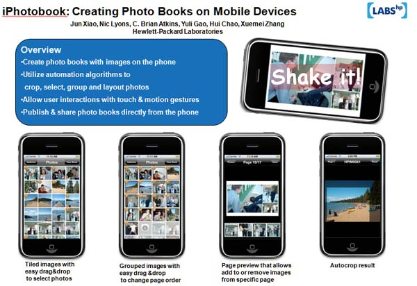

##iPhotobook
By Jun Xiao

####Last updated on September 2009

## Introduction

iPhotobook is an iPhone app that enables users to create and edit photo books on the iPhones. See our [ACM MM' 10 paper](http://dl.acm.org/citation.cfm?id=1874282) on this app and our later [iPad app](http://www8.hp.com/uk/en/products/smart-phones-handhelds-calculators/mobile-apps/app_details.html?app=tcm:183-824672&platform=tcm:183-824963) in the app store.

